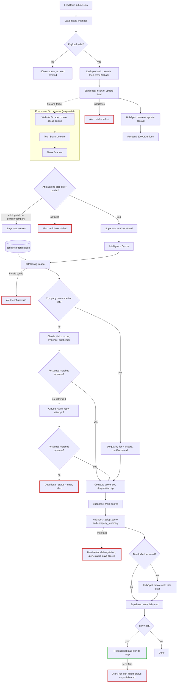

# Lead Intelligence Pipeline

Lead Intelligence Pipeline turns a form submission into a scored, drafted, CRM-ready lead in about 34 seconds, for under two cents. It enriches the lead (website, tech stack, recent news), scores it against a configurable ideal-customer profile, drafts a personalized outreach email, and writes it to HubSpot with a hot-lead alert if it clears the bar — no human touches any of it. I built this as a portfolio project for GTM/RevOps engineering roles, but it's built to run a real one: swap in a new ICP config file and it scores a different business, no code changes.

## Architecture

Here's the full pipeline, every stage and every dead-letter branch, as it actually runs today:

Red borders are dead-letter and alert paths — every one pages me, none fail silently. Green is the one success-path alert, a hot lead, deliberately not wired through error handling since a hot lead isn't a failure.

## How it works

A lead starts at a Next.js form, or any webhook that can POST the same shape. n8n picks it up, checks Supabase for a duplicate by domain, falling back to email, and writes the row — a new insert or an update, never a duplicate. The form gets its 200 back in a few seconds regardless of what happens next; enrichment kicks off in the background and never blocks the response.

From there, an n8n sub-workflow scrapes the company's homepage, about, and pricing pages, fingerprints their tech stack from what's on those pages, and pulls the last 90 days of news by company name. Real websites fail constantly, timeouts, JS-only pages, robots.txt blocks, so each step reports its own status instead of taking the whole lead down with it.

Once enrichment settles, the lead goes to the Intelligence Scorer: one call to Claude Haiku, given the lead's message plus everything enrichment found, comes back with a score across five weighted dimensions, evidence for each one, buying signals, objection risks, and a draft outreach email. Code, not the model, does the weighted math, applies a disqualifier cap if the lead trips one, and assigns a tier.

From there it's a write to HubSpot: score and a company summary land on the contact, the draft email attaches as a note if the lead cleared the discard tier, and a hot lead fires a Resend alert on top of the normal delivery. Every failure point along the way, a bad payload, an enrichment wipeout, a malformed model response, a failed HubSpot write, dead-letters the lead and sends a Resend alert instead of failing silently.

The ICP itself lives in a JSON config file, not in code: scoring dimensions, weights, thresholds, disqualifiers, even the sender's name and tone. Onboarding a second client means writing a new config file, not touching the pipeline.

## ICP scoring

Five dimensions, weighted:

| Dimension | Weight | Grounded in |
|---|---|---|
| Company fit | 30 | Company size, B2B software/tech category |
| Pain signals | 30 | The lead's own message: hiring signals, manual-process language, recent funding |
| Buying intent | 20 | The message only, never enrichment |
| Tech maturity | 15 | Detected tech stack, not a claimed one |
| Market timing | 5 | Recent news, the weakest evidence, weighted accordingly |

Four hard disqualifiers sit on top of the weighted score, not inside it: a personal email with no discoverable company, a student or job-seeker inquiry, a direct competitor, and headcount over 1,000. Three of those are model judgment against a strict written definition, checked at score time. The fourth isn't. Competitor status is a checked list in code: Attio, Clearbit, Apollo, Clay, HubSpot, Outreach, Salesloft. I ran a controlled experiment and found the model can't be trusted with that call — real, recognizable brand names got disqualified as competitors 60% of the time, and the same lead with the name scrubbed out dropped to 17%. That's a name-recognition bias firing before the model reads the definition, not a wording problem, and no amount of prompt tuning reaches it. A short list in config does.

The other design call worth explaining: the model drafts an email for every lead, even ones that end up disqualified or scored too low to send. Code decides after scoring whether that draft ships. I could have told the model to skip drafting for bad leads and saved a few hundred tokens a call. I didn't, because that couples two separate decisions, should I write to this lead and is this lead worth talking to, and coupling them meant an earlier prompt version silently threw away leads that a wrongly-tripped disqualifier had misjudged. Split the two, and fixing the disqualifier recovers those leads for free, with zero change to how drafting works.
