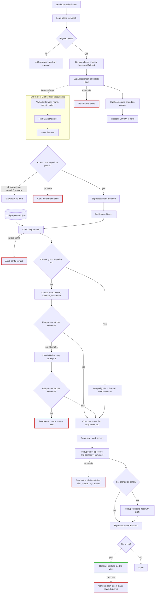

# Lead Intelligence Pipeline

Lead Intelligence Pipeline turns a form submission into a scored, drafted, CRM-ready lead in about 34 seconds, for under two cents. It enriches the lead (website, tech stack, recent news), scores it against a configurable ideal-customer profile, drafts a personalized outreach email, and writes it to HubSpot with a hot-lead alert if it clears the bar — no human touches any of it. I built this as a portfolio project for GTM/RevOps engineering roles, but it's built to run a real one: swap in a new ICP config file and it scores a different business, no code changes.

## Architecture

Here's the full pipeline, every stage and every dead-letter branch, as it actually runs today:

Red borders are dead-letter and alert paths — every one pages me, none fail silently. Green is the one success-path alert, a hot lead, deliberately not wired through error handling since a hot lead isn't a failure.

## How it works

A lead starts at a Next.js form, or any webhook posting the same shape. n8n checks Supabase for a duplicate by domain (falling back to email) and writes the row, insert or update. The form gets its 200 back in seconds; enrichment runs in the background and never blocks it.

An n8n sub-workflow scrapes the company's homepage, about, and pricing pages, fingerprints their tech stack, and pulls the last 90 days of news by company name. Real websites fail constantly, so each step reports its own status without taking the whole lead down.

One Claude Haiku call, given the message plus everything enrichment found, returns a score across five weighted dimensions with evidence, buying signals, objection risks, and a draft email. Code, not the model, does the weighted math, applies a disqualifier cap, and assigns a tier.

From there it's a write to HubSpot: score and summary on the contact, the draft attached as a note if the lead cleared discard, a Resend alert if it's hot. Every failure point, bad payload, enrichment wipeout, malformed response, failed write, dead-letters the lead and alerts instead of failing silently.

The ICP lives in a JSON config file, not code: dimensions, weights, thresholds, disqualifiers, even sender identity. A second client means a new config file, not a rebuild.

## ICP scoring

Five dimensions, weighted:

| Dimension | Weight | Grounded in |
|---|---|---|
| Company fit | 30 | Company size, B2B software/tech category |
| Pain signals | 30 | The lead's own message: hiring signals, manual-process language, recent funding |
| Buying intent | 20 | The message only, never enrichment |
| Tech maturity | 15 | Detected tech stack, not a claimed one |
| Market timing | 5 | Recent news, the weakest evidence, weighted accordingly |

Four hard disqualifiers sit on top of the weighted score, not inside it: a personal email with no discoverable company, a student or job-seeker inquiry, a direct competitor, and headcount over 1,000. Three are model judgment against a written definition. The fourth isn't: competitor status is a checked list in code (Attio, Clearbit, Apollo, Clay, HubSpot, Outreach, Salesloft). I ran a controlled experiment and found the model can't be trusted with that call — real, recognizable brand names got disqualified as competitors 60% of the time, dropping to 17% with the name scrubbed out. That's a name-recognition bias firing before the model reads the definition, and no amount of prompt tuning reaches it.

The model also drafts an email for every lead, even disqualified or low-scored ones, and code decides after scoring whether that draft ships. I could have told the model to skip drafting for bad leads and saved tokens. I didn't: that couples two separate decisions, should I write to this lead and is this lead worth talking to, and an earlier prompt version silently threw away leads a wrongly-tripped disqualifier had misjudged. Splitting the two means fixing the disqualifier recovers those leads for free.

## Cost model

A lead costs $0.0141 to $0.0170 to score under the current prompt, comfortably under the $0.02 target. That's one Claude Haiku call; a second attempt only fires if the first fails schema validation, which is rare.

That range isn't open-ended by luck: enrichment is capped at 4,000 characters per page, three pages max, and news at the 5 most recent items. Cost tracks enrichment richness, not model verbosity.

A prompt rewrite mid-project (v1 → v2) fixed a grounding bug: the model was asserting facts, like headcounts, that weren't in the lead data. Grounding every score in evidence and requiring a source quote for size claims raised cost 1.37x on the same five test leads, almost entirely in output tokens, since v2 also drafts for leads v1 used to silently discard. Still well under budget. Full numbers in [docs/COST-ANALYSIS.md](docs/COST-ANALYSIS.md).

The same pipeline that scores a lead for under two cents also gets it from form submit to a live HubSpot contact in about 34 seconds, well inside the 90-second target.

## Key decisions and tradeoffs

**Claude Haiku over Sonnet.** Cost had to be predictable at volume, one call per lead, every time. Haiku scores the same five dimensions under the same grounding rules for a fraction of Sonnet's price, and scoring needs consistent extraction against a fixed rubric, not frontier reasoning. A 34-second budget has no room for a model that occasionally thinks longer.

**n8n over Zapier or Make.** Priced per execution, not per task. It also meant building real orchestration, sub-workflows, retries, dead-letters, instead of chaining prebuilt steps, closer to what RevOps engineering actually looks like.

**Config-as-data, not code.** The entire ICP lives in one JSON file, validated on load, never silently defaulted. A second client is a new config, not touched scoring logic. The weights are still an unvalidated v1 hypothesis, though: the spot-check meant to tune them against real outcomes got deferred and never completed.

**The competitor name-prior experiment.** Covered above under ICP scoring, worth flagging on its own: when a bug looks like a prompt problem, the fix isn't always a better prompt. I ran the experiment before writing a line of new prompt.

**Dead-letter without reverting status.** A delivery failure after a lead is already scored doesn't roll it back to a redo state. It dead-letters delivery and leaves the score in place, since a scoring failure and a delivery failure mean different things, and conflating them would make a HubSpot outage look like a broken score.

## Tech stack

- **n8n** (self-hosted on Hetzner) — orchestration: intake, enrichment, scoring, delivery, dead-letters.
- **Supabase** (Postgres) — source of truth for every lead, RLS-locked, service-role key only.
- **Claude Haiku** — one structured call per lead: score, evidence, draft email.
- **HubSpot** (Free tier) — CRM delivery: contact properties, a note with the draft.
- **Resend** — every alert: intake failures, enrichment failures, malformed scorer output, delivery failures, hot leads.
- **Vercel** — hosts the Next.js intake form, CI/CD from `main`.
- **Hetzner + Caddy** — the VPS n8n runs on, HTTPS via Caddy's automatic cert handling.

## What I'd do next

Phase 2 is running this against a real client's inbound leads instead of test fixtures: retuning the scoring weights against actual close/no-close outcomes instead of my own judgment calls, and building the reporting dashboard (volume, score distribution, source quality, latency) that's been scoped in the original architecture but never built. The pipeline is ready for that load; what it's missing is real outcome data to tune against.
