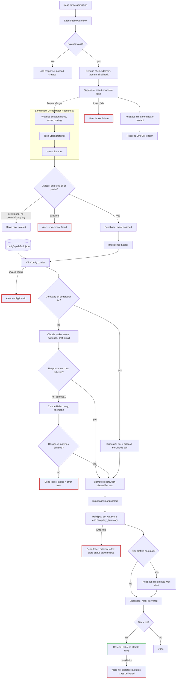

# Lead Intelligence Pipeline

Lead Intelligence Pipeline turns a form submission into a scored, drafted, CRM-ready lead in about 34 seconds, for under two cents. It enriches the lead (website, tech stack, recent news), scores it against a configurable ideal-customer profile, drafts a personalized outreach email, and writes it to HubSpot with a hot-lead alert if it clears the bar — no human touches any of it. I built this as a portfolio project for GTM/RevOps engineering roles, but it's built to run a real one: swap in a new ICP config file and it scores a different business, no code changes.

## Architecture

Here's the full pipeline, every stage and every dead-letter branch, as it actually runs today:

Red borders are dead-letter and alert paths — every one pages me, none fail silently. Green is the one success-path alert, a hot lead, deliberately not wired through error handling since a hot lead isn't a failure.
