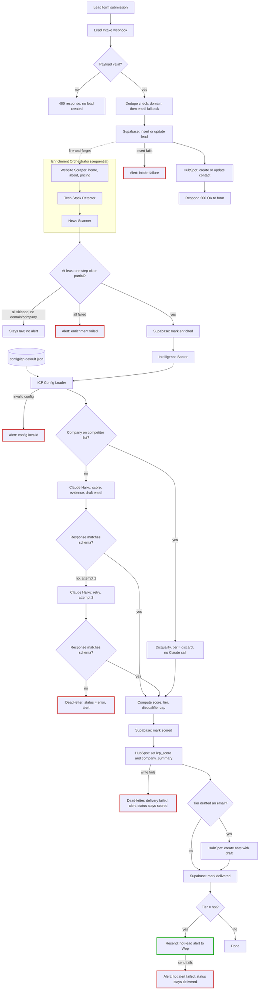

# Pipeline diagram

Full flow, form submission to CRM delivery, including every dead-letter and alert branch. Rendered from the actual n8n workflows (`lead-intake.json`, `enrichment-orchestrator.json`, `intelligence-scorer.json`) and `config/icp.default.json` as of Sprint 6 — not the original architecture sketch, the as-built pipeline.

Red borders are dead-letter/alert paths — every one of them pages Wop, never fails silently. Green is the one success-path alert (a hot lead), deliberately not wired through the error-workflow mechanism, since a hot lead isn't a failure.

## Two corrections to the original design

- **Enrichment is sequential, not parallel.** `docs/ARCHITECTURE.md`'s original sketch called for the website/tech-stack/news trio to run in parallel. #23 shipped them sequential (Website Scraper → Tech Stack Detector → News Scanner) — that's what's actually running, so that's what's diagrammed.
- **The hot-tier threshold is 72, not 75.** `docs/ARCHITECTURE.md`'s original target was "score ≥75". The shipped config (`config/icp.default.json`, `thresholds.hot`) is 72, as of `config_version 1.3.0-v1`. The diagram's "Tier = hot?" gate reflects the real threshold.
